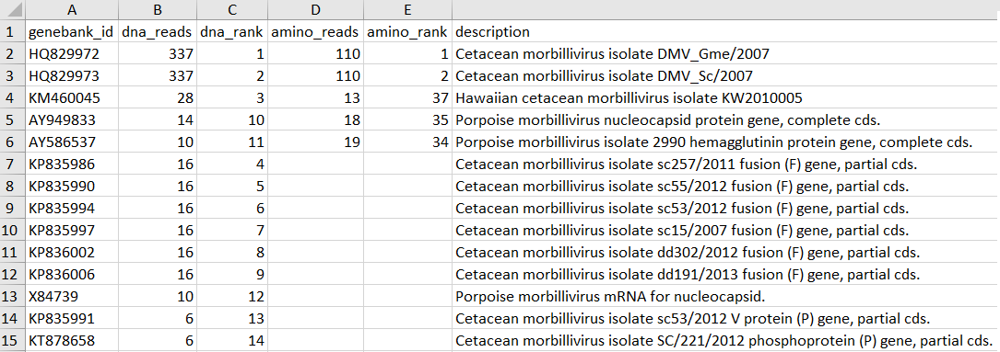
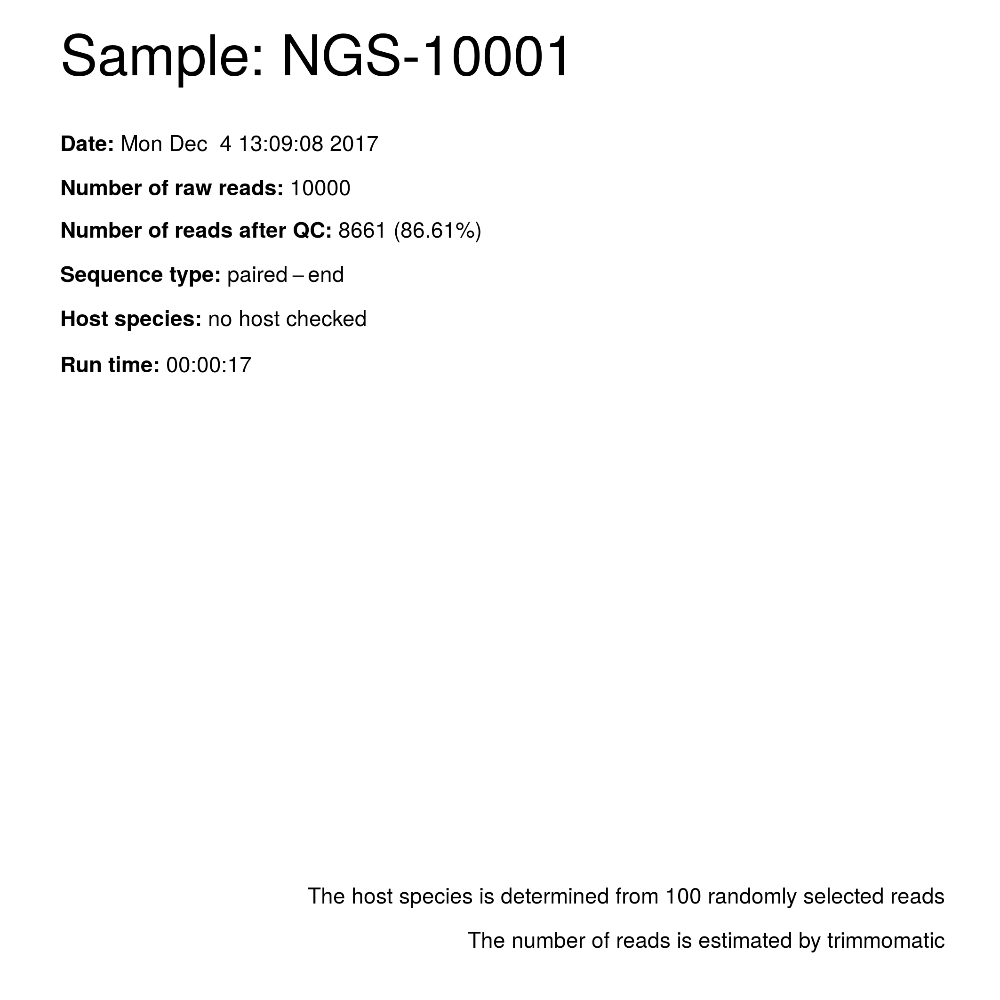
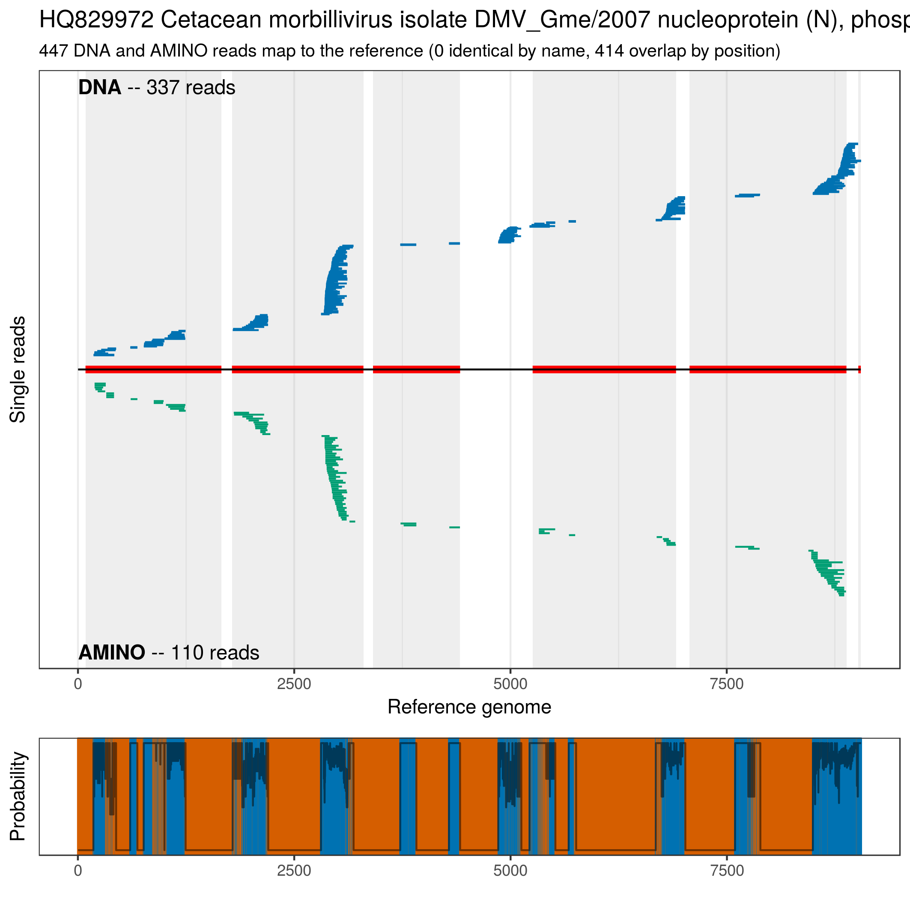
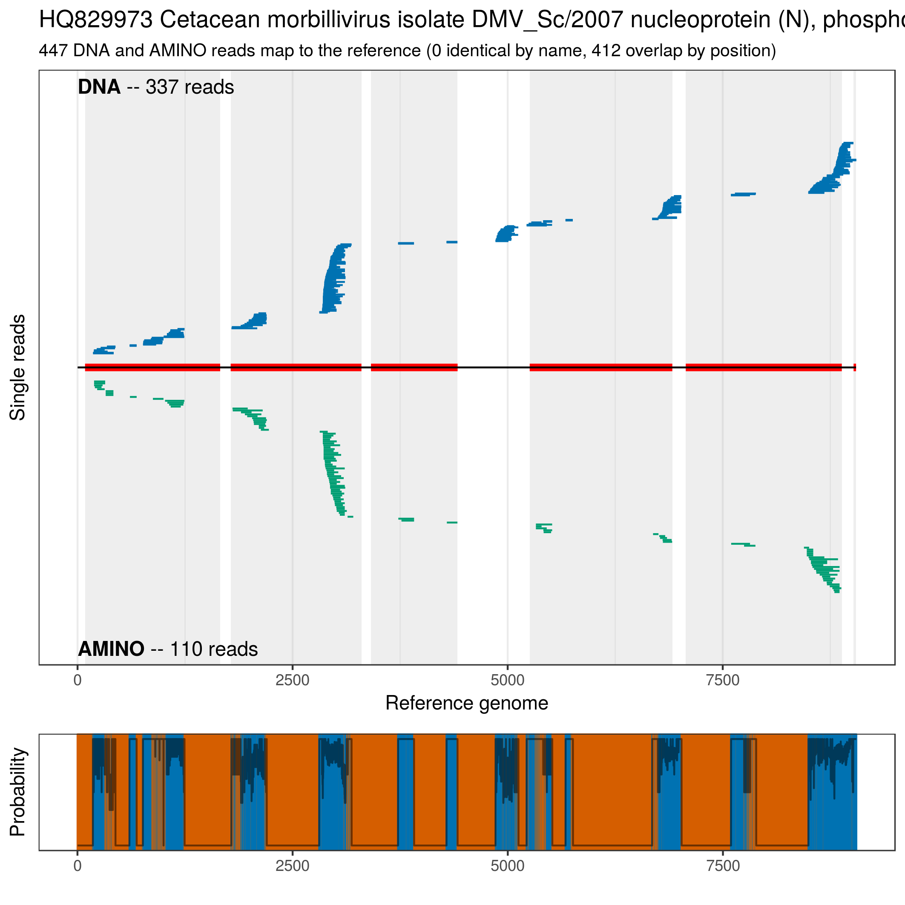
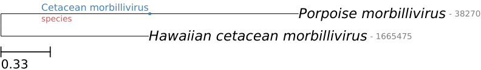

# viralDetectTools
Modules for a viral detection pipeline. Uses external tools and software. No standalone.

## Table of Contents
1. [Installation](#installation)
2. [Tutorial](#tutorial)


## Installation

The development version from github. Do not do it, if you are not sure what you are doing!

```R
devtools::install_github("jkruppa/viralDetectTools")
```

## Tutorial

### Dependencies

```R
program_list <- set_program_list(bowtie_dir = file.path(programDir, ... , "bowtie2"),
                                 star_dir = file.path(programDir, ... , "STAR"),
                                 pauda_dir = file.path(programDir, ... , "pauda-run"),
                                 bowtie_build_dir = file.path(programDir, ... , "bowtie2-build"),
                                 pauda_build_dir = file.path(programDir, ... , "pauda-build"),
                                 pandaseq_dir = file.path(programDir, ... , "pandaseq"),
                                 ete3_dir = file.path(programDir, ... , "ete3"),
                                 blastn_dir = file.path(programDir, ... , "blastn"),
                                 seqtk_dir = file.path(programDir, ... , "seqtk"),
                                 samtools_dir = file.path(programDir, ... , "samtools"),
                                 trimmomatic_dir = file.path(programDir, ... , "trimmomatic-0.36.jar"))
```

### File setup

```R
## install packages
## install.packages("pacman")
p_load(plyr, ShortRead, Biostrings)

## setup demonstration file system
main_dir <- tempdir()
in_dir <- file.path(main_dir, "input")
out_dir <- file.path(main_dir, "output")
tmp_viral_dir <- file.path(main_dir, "tmp")
dir.create(in_dir)
dir.create(out_dir)
```

### Example read files and viral reference genomes

```R
## load the data
data(infected_fastq)
R1_fq <- file.path(in_dir, "NGS-10001_R1.fastq.gz")
R2_fq <- file.path(in_dir, "NGS-10001_R2.fastq.gz")

## write the read data to fastq files
mapply(writeFastq, infected_fastq, list(R1_fq, R2_fq))

## load the reference DNA sequences
data(dna_seqs)
```

```R
R> dna_seqs
   A DNAStringSet instance of length 287
       width seq                                             names
   [1]  1800 ACCAGACAAAGCTGGCTAGGGG...CTTCCACCGACACTGTCTCCAA AY949833 AY949833...
   [2]   430 CAAGGTATGTTTCACGCTTATC...CCTATACCCAGCTTTGTCTGGT AY949834 AY949834...
   [3]  9050 GTAGAATAACAGATAATGATAA...CATCTCAATCAACCAGATCCTA HQ829972 HQ829972...
   [4]  9050 GTAGAATAACAGATAATGATAA...CATCTCAATCAACCAGATCCTA HQ829973 HQ829973...
   [5]   369 GCTGTAATTAGAAATGCTCAGC...TAAAGAGAAAGAAATCAAAGAG KU053510 KU053510...
   ...   ... ...
 [283]  4865 CCATTAAAAAGGGCACAGACGT...ACTCGTTAGGTTATATATACAC EMU49404 U49404 E...
 [284]   389 GAAGAGGTTAAGGGAATCGCAG...GAATGGGGATAGTTGCTGGATC CDU76708 U76708 C...
 [285]   389 GAAGAGGTTAAGGGAATCGCAG...GAATGGGGATAGTTGCTGGATC CDU76709 U76709 C...
 [286]  2193 TGAATCTGAGCAACAATCGACA...TTAATTAATAAATAACTAAAGA X80757 X80757 C.m...
 [287]   924 GCATTAATTTTAGATATCAAAA...TCACACTTTCATCAGTATTACA X84739 X84739 Por...
```

```R
data(aa_seqs)
```

```R
R> aa_seqs
   A AAStringSet instance of length 521
       width seq                                             names
   [1]   523 MATLLRSLALFKRNKDRTPIIA...LLENQSSHDTTAHVYNDKDLLG AAX47056.2_AY9498...
   [2]   106 QGMFHAYPVLVDSRQRELVSRI...RLETSEIKEWFKLIGYGALIRE AAX47057.1_AY9498...
   [3]   523 MATLLRSLALFKRNKDRTPLTA...LLENQGPRDVTAHVYNDKDLLG AEO51046.1_HQ8299...
   [4]   506 MAEEQAYHVNKGLECLKSLREN...LNDVKSGKDLGEFYQMVKKIIK AEO51047.1_HQ8299...
   [5]   335 MTEVYDFDRSAWDVKGSIAPIE...PQEFRVYDDVIINDDQGLFKIL AEO51048.1_HQ8299...
   ...   ... ...
 [517]   130 EEVKGIADADSLVVPASAVSNR...GTIKKGTGERLASHGMGIVAGS AAB19205.1_CDU767...
 [518]   552 MASNDNSVIYHSFLTVILLVVV...PKSTPGLKPDLTGTTKSYVRSL CAA56731.1_X80757...
 [519]   289 ALILDIKRTPGNKPRIAEMICD...LLENQSSHDTTAHVYNDKDLLG CAA59229.1_X84739...
 [520]   288 FLDGIDKAQEDHEKYHSNWRAM...IIRDYGKQMAGDGCVASGQDED BAX84739.1_LC1608...
 [521]   470 MNPNQKIITIGSVSLGLVVLNI...DHEVADWSWHDGAILPFDIDKM AFX84739.1_CY1268...
```

### Build reference genome for Bowtie2 and Pauda


```R
viral_ref_dna_fa <- file.path(in_dir, "viral_ref_dna.fa") 
viral_ref_aa_fa <- file.path(in_dir, "viral_ref_aa.fa") 

## write the DNA sequences as fasta file
writeXStringSet(dna_seqs, viral_ref_dna_fa)
writeXStringSet(aa_seqs, viral_ref_aa_fa)

## set the mapper index dir
viral_index_dir <- file.path(main_dir, "viral_index")

## run the index 
viral_index_list <- build_index(dna_set = dna_seqs,
                                aa_set = aa_seqs,
                                index_dir = viral_index_dir,
                                index_name = "viral",
                                force = FALSE)
```

### Setup SQL database

```R
## load the data implemented in the package
data(aa_info_db)
```
```R
R> aa_info_db
 # A tibble: 519 x 5
       prot_id genebank_id pos_start pos_end    ind
         <chr>       <chr>     <dbl>   <dbl>  <int>
  1 AHZ20683.1    KJ482570         1     312 157109
  2 ARQ82876.1    KX914861         1     170 221056
  3 ARQ82877.1    KX914862         1     170 221057
  4 ARQ82878.1    KX914863         1     170 221058
  5 ARQ82879.1    KX914864         1     170 221059
  6 ASV51313.1    KX943319         1    1824 235357
  7 ASV51314.1    KX943320         1    1824 235358
  8 ASV51315.1    KX943321         1    1824 235359
  9 ASV51316.1    KX943322         1    1824 235360
 10 ASV51317.1    KX943323         1    1824 235361
 # ... with 509 more rows
```

```R
data(strain_info_db)
```

```R
R> select(strain_info_db,
 +        genebank_id, -Accession, tax_id:Description)
 # A tibble: 287 x 6
    genebank_id tax_id Accession Length               Organism
          <chr>  <chr>     <chr>  <int>                  <chr>
  1    FJ648457  38270  FJ648457   1946 Porpoise morbillivirus
  2    FJ842380  36410  FJ842380    158 Cetacean morbillivirus
  3    FJ842381  36410  FJ842381    358 Cetacean morbillivirus
  4    FJ842382  36410  FJ842382    904 Cetacean morbillivirus
  5    GQ149614  36410  GQ149614    145 Cetacean morbillivirus
  6    HQ829972  36410  HQ829972   9050 Cetacean morbillivirus
  7    HQ829973  36410  HQ829973   9050 Cetacean morbillivirus
  8    JN210891  36410  JN210891    389 Cetacean morbillivirus
  9    JQ326990  36410  JQ326990    551 Cetacean morbillivirus
 10    JQ326991  36410  JQ326991    541 Cetacean morbillivirus
 # ... with 277 more rows, and 1 more variables: Description <chr>
```

```R
aa_info_db_file <- file.path(in_dir, "aa_info_db.sqlite3")

setup_aa_info_sample_sqlite(prot_id = aa_info_db$prot_id,
                            genebank_id = aa_info_db$genebank_id,
                            prot_start = aa_info_db$pos_start,
                            prot_end = aa_info_db$pos_end,
                            db_file = aa_info_db_file)

strain_info_db_file <- file.path(in_dir, "strain_info_db.sqlite3")

setup_species_info_sqlite(genebank_id = strain_info_db$genebank_id,
                          length = strain_info_db$Length,
                          description = strain_info_db$Description,
                          tax_id = strain_info_db$tax_id,
                          db_file = strain_info_db_file)

```

### Start artifical genome mapping

```R

## parameter list
par_viral_list <- set_par_list(index_genome_dir = viral_index_list$bowtie_index, 
                               index_amino_dir = viral_index_list$pauda_index,
                               ref_seq_file = viral_ref_dna_fa, 
                               prot_info_df = tbl(src_sqlite(aa_info_db_file), "aa_info_df"),
                               species_info_df = tbl(src_sqlite(strain_info_db_file), "species_info_df"))

par_viral_list["tmp_dir"] <- tmp_viral_dir
par_viral_list["check_host"] <- FALSE


viral_files <- get_sub_files("NGS-10001",
                             in_dir = file.path(in_dir),
                             out_dir = file.path(in_dir))


## run the partial mapping
artificial_genome_mapping(in_file = viral_files$in_file,
                          out_file = viral_files$out,
                          par_list = par_viral_list)
```


```R
R> artificial_genome_mapping(in_file = viral_files$in_file,
 +                           out_file = viral_files$out,
 +                           par_list = par_viral_list)
 Dez 04 14:01:33 ..... Write to /tmp/RtmpmN8czE/input/NGS-10001
 Dez 04 14:01:33 ..... Temp dir /tmp/RtmpmN8czE/tmp not found. Will be created...
 Dez 04 14:01:34 ..... Gene and species information is correct
 Dez 04 14:01:34 ..... Start trimming
 Dez 04 14:01:35 ..... Start DNA mapping
 Dez 04 14:01:36 ..... Working on NGS-10001_dna.sam
 Dez 04 14:01:37 ..... Save DNA mapping results...
 Dez 04 14:01:37 ..... Start AMINO mapping
 Dez 04 14:01:37 ..... Run pandaseq to build up one fastq file
 Dez 04 14:01:37 ..... Run pauda
 Dez 04 14:01:38 ..... Process pauda hits
 Dez 04 14:01:40 ..... Save AMINO mapping results...
 Dez 04 14:01:40 ..... Save hits to xlsx
 Dez 04 14:01:40 ..... Generate pylogenetic tree
 Dez 04 14:01:41 ..... Generate consensus of reads to reference
 Dez 04 14:01:44 ..... Get the number of raw reads
 Dez 04 14:01:44 ..... Build sample info
 Dez 04 14:01:44 ..... Start generating the mapping pdf
   |======================================================================| 100%
 Dez 04 14:01:57 ..... Transfrom png files to one pdf
 Dez 04 14:02:22 ..... Finished
```

## Output files

### Count \*.xlsx file

<p align="center">
  
</p>

### Summary file of the sequence visualization

<p align="center">
  
</p>

### First and second figure out of 25

<p align="center">
  
</p>

<p align="center">
  
</p>

### Phylogenetic tree by the findings

<p align="center">
  
</p>
